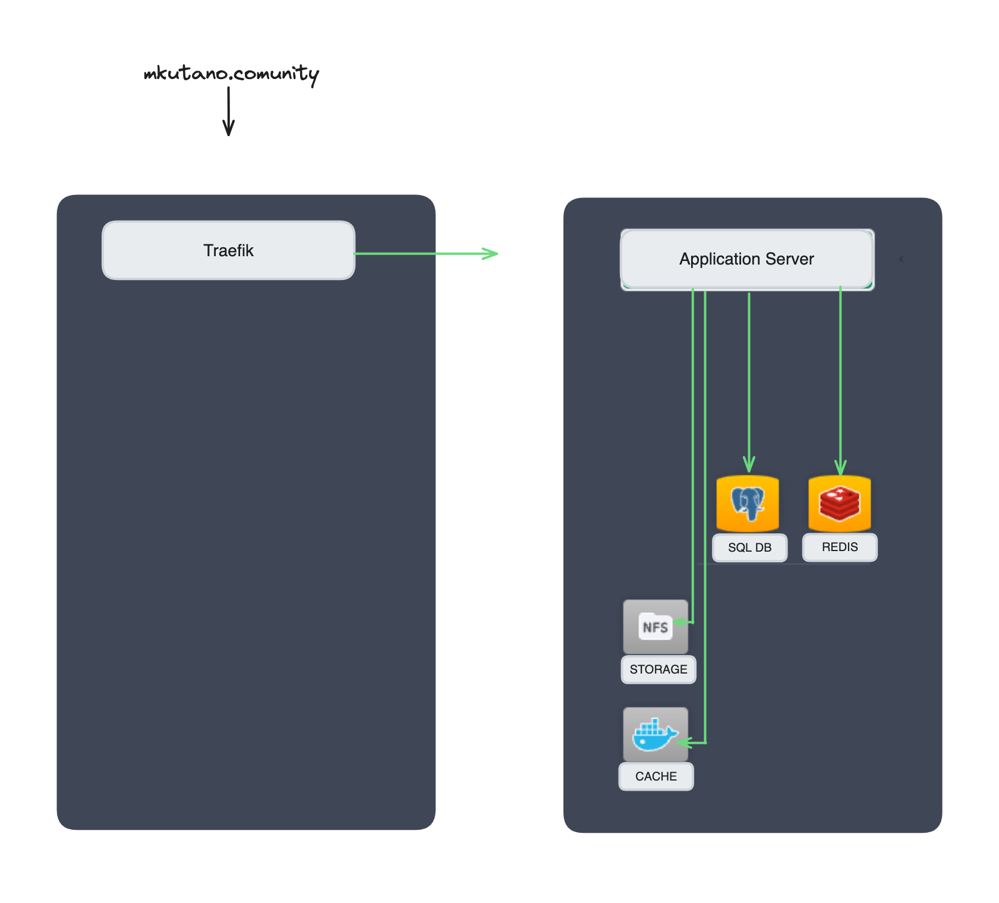

# Mkutano Community Platform
MKUTANO is a participatory and engagement platform where Black Canadians can meet to efficiently, effectively, transparently & democratically organize.
Here we discuss, debate, and vote to reach consensus on important community themes. We also plan and implement our development through coordination, cooperation, and collaboration.
We determine our collective priorities, which enables us to accurately communicate our demands to Governments and Civil Society.


**We are stronger, and will achieve more faster, if we work together.**


##  Contributing to the portal
The Mkutano Community Platform runs on the open source software [Decidim](https://decidim.org).
Code changes are accepted via pull requests.  If you find a bug please report it via issues.


# Install the Mkutano Community Platform locally
## Infrastructure


Our infrastructure is based on two segregated environments. The first one handle let's encrypt certificates and load balancing. The second one handle a decidim infrastructure with postgres database, memcache caching and redis queues.

## With a production-like setup
To run almost the same production infrastructure locally:

Start the docker-compose:
```
docker-compose up
```

In a new terminal, you can run a database seed.
```
docker-compose run --rm decidim bundle exec rails db:seed
```

Access: 

- localhost:8080 for the decidim
- localhost:1080 for the mailcatcher

## With a development setup
> Warning, there are known issues running this development docker
> on M1 Apple processor. You have been warned.


Start a decidim instance with no command
```
docker-compose -f docker-compose.dev.yml up -d
```

Run webpacker
```
docker-compose -f docker-compose.dev.yml run --rm decidim bin/webpack-dev-server
```

Run rails server
```
docker-compose -f docker-compose.dev.yml run --rm decidim bundle exec rails s -b 0.0.0.0
```

Run migrations
```
docker-compose -f docker-compose.dev.yml run --rm decidim bundle exec rails db:migrate
```

Run a database seed
```
docker-compose -f docker-compose.dev.yml run --rm decidim bundle exec rails db:seed
```

Access: 

- localhost:3000 for the rails server
- localhost:3000/letter_opener for the mail catcher
- credentials are the default ones (see decidim documentation)
